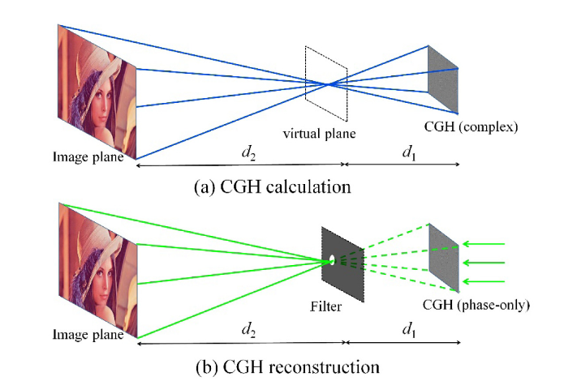

# Speckle reduced lensless holographic projection from phase-only computergenerated hologram

## 摘要

```
基础方法：
利用虚拟汇集光替代随机相位进行空间相位传递

主要成就：
1.在数值模拟和实际中验证了对散板噪声的抑制作用
2.可以很好的利用slm的空间尺寸，最紧凑型无透镜全息投影有很好的作用


```

## introduction

> More recently, T. Shimobaba introduced a “random phase-free (RPF)” method \[12, 13] that can improve the image quality and reduce the speckle noise by multiplying the image with an initial spherical phase. Despite usefulness in terms of speckle problems in lensless holographic projection applications, the RPF method suffers limitation of image size due to existence of zero 随即县er and conjugated component

这表明原来的只用球面初始相位来代替随机相位是不太ok的

> First, 4-f optical filtering system is employed to reconstruct complex amplitude, increasing the complexity of the system by the presence of bulky lenses, which requires much space due to its finite focal length and aperture. Second, the size of the reconstructed image is greatly restricted, because when the image size is larger than the CGH, the desired information of the complex amplitude image is difficult to be filtered by 4-f system.

这表明利用4-f系统会大大增加系统的复杂度

***

#### **所以我们得出结论**

我们得到了一种可以解决散斑噪声的方法，并且可以缩放达到slm的最大衍射带宽

## Method and situmulation

> first, all of the information of image can widely spread to the CGH whose size is smaller than the image, without losing low-frequency information of the image \[13]. Second, the light field of image is required to be focused into a small spot at the virtual plane through diffraction, which is necessary in the filtering system of the CGH reconstruction.

声明了用arss的两个好处：一个是能更好的保留低频信息；另一个是能把所有信息聚集在虚拟屏幕上，为后续的滤波奠定了基础

***

虚拟汇聚光如图所示

$$
\phi(x,y)=-\frac{\pi(x^2+y^2)}{\lambda d} 
$$

二维物函数 $A(x,y)$\
故所要传递的复振幅可以表示成

$$
I(x,y)=A(x,y)\cdot \exp(i\phi(x,y))
$$

***

整个建立cgh的过程可以分为两步，如图所示



***step 1:物光场投射到虚拟平面上*** 物光场的复振幅可以通过下面的形式传递到虚拟平面上:

$$
VP(x_v, y_v) = \iint I(x, y) \cdot \exp \left( \frac{i \pi}{\lambda d_2} \left[ (x_v - s_x)^2 + (y_v - s_y)^2 \right] \right) dx\,dy 
\\
= \mathcal{F}^{-1} \left\{ \mathcal{F} \left[ I(x, y) \cdot \exp(i \varphi_1) \right] \cdot \mathcal{F} \left[ \exp(i \varphi_2) \cdot \text{Rect} \right] \right\}
$$

其中，Vp代表虚拟平面的复振幅，s代表着缩放因子，rect代表着空间滤波器，这是一个ARSS-fresnel过程

***step 2:虚拟平面到cgh平面***

$$
H(x_h, y_h) = \iint VP(x_v, y_v) \cdot \exp \left\{ \frac{i\pi}{\lambda d_1} \left[ (x_h - x_v)^2 + (y_h - y_v)^2 \right] \right\} dx_v dy_v 
\\
= \exp \left[ \frac{i\pi(x_h^2 + y_h^2)}{\lambda d_1} \right] \cdot FFT \left[ VP(x_v, y_v) \cdot \exp \left( \frac{i\pi(x_v^2 + y_v^2)}{\lambda d_1} \right) \right]
$$

这是一个简单的s-fft过程

***
*编码过程*
对于已经得到的复振幅，我们可以通过离轴双相位进行编码，其具体过程如图所示：

$$
\theta_1(x_h,y_h)=\phi_h(x_h,y_h)+\cos^{-1}\left[A_h(x_h,y_h)/A_{max}\right]
$$

$$
\theta_2(x_h,y_h)=\phi_h(x_h,y_h)-\cos^{-1}\left[A_h(x_h,y_h)/A_{max}\right]
$$

其中，$\phi_h A_h$分别指代复振幅的幅度和相位

而CGH的最后表达形式如图所示
$$
p(x_h,y_h)=\theta_1\cdot M_1+\theta_2\cdot M_2+2\pi x_h sin\alpha/\lambda
$$
其中M指的是两个交替的棋盘格
